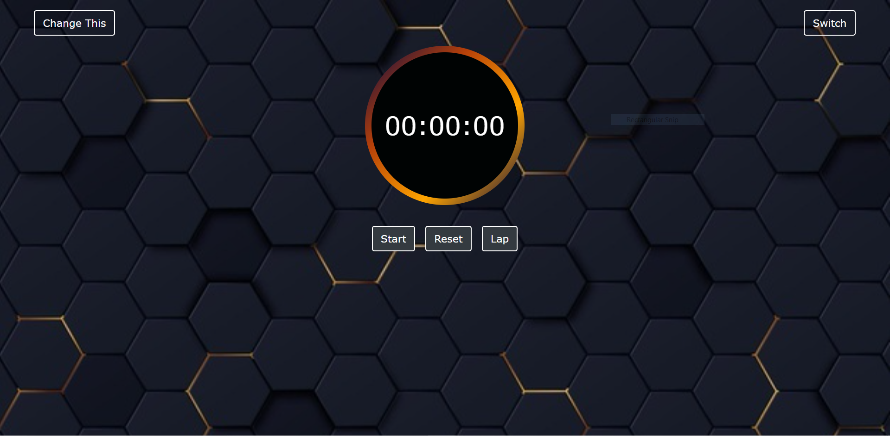
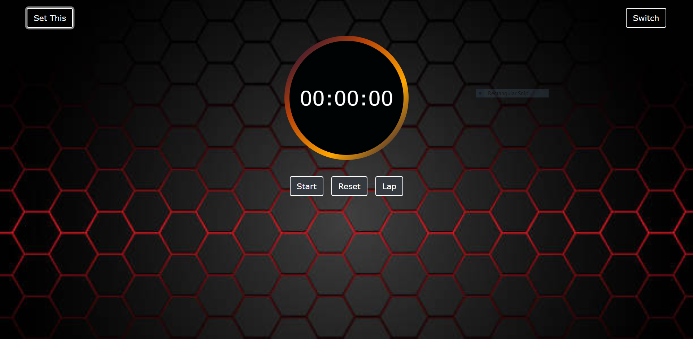
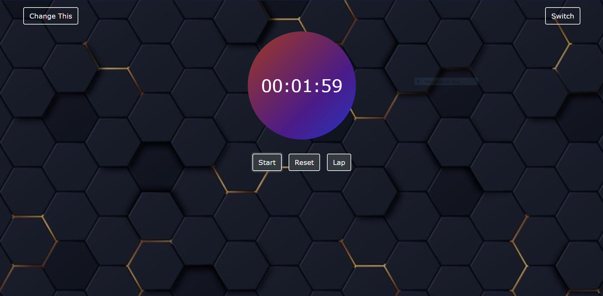
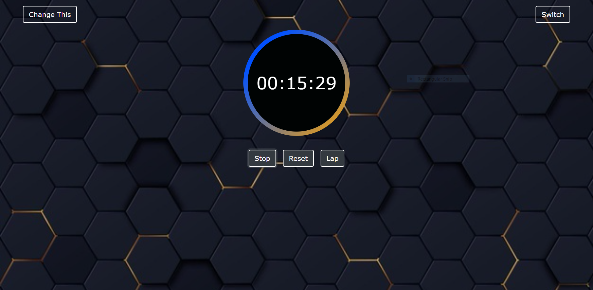

#STOPWATCH
##First Look


##About
```
1. This is a simple stopwatch in which you can count time for any event.
2. You can record laps here.
3. In this stopwatch when you start the clock you will see some changes in color in background of clock.
2. You have option to change the background.
3. You have option to change the style of clock.
```
## How to change Background
1. Click on Change This buttons.
2. After that background will start changing.



3. Click on Set This to set the current background.

## How to change the Stopwatch
1. Just click on Switch button to change the design of Stopwatch.



## How to start/Stop/Reset the stopwatch
1. Click on start to start counting.



2. For stopping the stopwatch click on Stop button.
3. To reset the stopwatch click on Reset button.

## How to record the laps
1. Just click on Lap button to record the lap.


2. To clear all the laps just click on Clear All. It will clear all the laps.